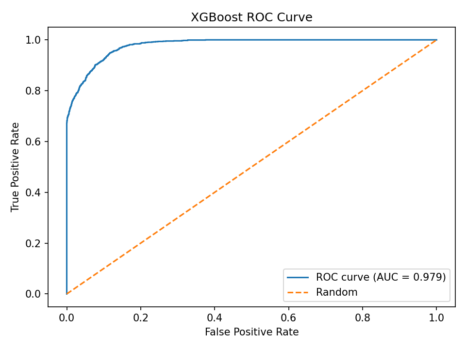
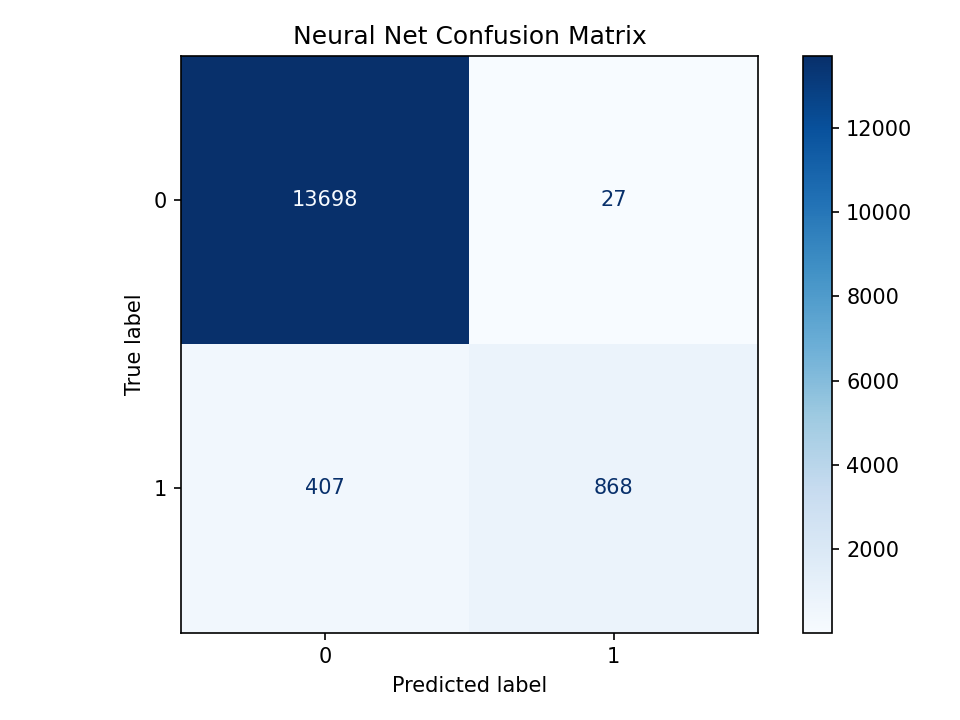

#  Diabetes Prediction AI Project
**Florida Atlantic University — Intro to AI (CAP 4630)**  
**Team Members:** Gil Abadio, Sorahya Eugene, Tom Le, Sarai Aguiar, Erin Patrician

---

#  Project Overview
This project implements a complete end-to-end machine learning pipeline for predicting diabetes using a dataset of behavioral, demographic, and health-related indicators. After data cleaning, feature engineering, and exploratory analysis, two high-performing models were selected:

- **XGBoost Classifier**
- **Neural Network (MLPClassifier)**

Both models were trained, validated, and evaluated on a held-out test set using metrics such as accuracy, precision, recall, F1-score, and ROC-AUC.

The repository includes the dataset, exploratory notebooks, full training pipeline, test evaluation, visualizations, and saved model artifacts for reproducibility.

---
```
# 📁 Repository Structure

│
├── data/
│ └── diabetes_prediction_dataset.csv
│
├── notebooks/
│ ├── data_quality_report.ipynb
│ ├── feature_analysis.ipynb
│ ├── model_selection.ipynb
│ └── Model_Evaluation_and_Baseline_Testing_updated.ipynb
│
├── src/
│ ├── preprocessing.py
│ ├── train.py
│ ├── evaluate.py
│ └── utils.py
│
├── results/
│ ├── preprocessor.pkl
│ ├── xgboost.pkl
│ ├── neural_network.pkl
│ ├── xgboost_confusion_matrix.png
│ ├── xgboost_roc_curve.png
│ ├── neural_net_confusion_matrix.png
│ └── neural_net_roc_curve.png
│
└── README.md
```
---

#  Dataset Description
**File:** `data/diabetes_prediction_dataset.csv`  
Includes the following categories of features:

### Health Metrics
- BMI  
- MentalHealth  
- PhysicalHealth  
- SleepTime  

### Behavioral Indicators
- Smoking  
- AlcoholDrinking  
- PhysicalActivity  
- DiffWalking  

### Demographics
- AgeCategory  
- Gender  
- Race  

### Target Variable
- **diabetes**: `1` = diabetic, `0` = non-diabetic

The data is cleaned, encoded, and transformed in the preprocessing pipeline.

---

#  Notebooks Overview

###  `data_quality_report.ipynb`
- Checks missing values  
- Duplicate detection  
- Distribution plots  
- Correlation heatmap  

###  `feature_analysis.ipynb`
- Feature importance  
- Key visualizations  
- Categorical encoding validation  

###  `Model_Evaluation_and_Baseline_Testing_updated.ipynb`
- Baseline model performance  
- Accuracy, Precision, Recall, F1 comparisons  

###  `model_selection.ipynb`
- Model experiments  
- Cross-validation  
- Final model selection (XGBoost + Neural Net)  

---

#  Source Code (src/)

##  `preprocessing.py`
Handles:
- CSV loading  
- **70/15/15** train/val/test stratified split  
- Numeric/categorical column detection  
- Missing value imputation  
- Creation of a `ColumnTransformer`  
  - StandardScaler → numeric  
  - OneHotEncoder → categorical  
- Produces:
  - `X_train_proc`, `X_val_proc`, `X_test_proc`
  - Saved preprocessor (`preprocessor.pkl`)

---

##  `train.py`
Trains the two final models:

### ✔ XGBoost Classifier  
- 300 trees  
- Depth 4  
- Learning rate 0.05  

### ✔ Neural Network (MLPClassifier)  
- Hidden layers: (64, 32)  
- ReLU activation  
- Early stopping enabled  

Outputs:
- Validation metrics printed to console  
- Saves:
  - `preprocessor.pkl`
  - `xgboost.pkl`
  - `neural_network.pkl`

---

##  `evaluate.py`
Performs final test evaluation:

- Reloads and re-splits dataset  
- Applies saved preprocessor  
- Loads trained models  
- Computes final test metrics:
  - Accuracy  
  - Precision  
  - Recall  
  - F1-Score  
  - ROC-AUC  
- Saves:
  - Confusion Matrices  
  - ROC Curves  
- Prints a side-by-side comparison table

---

##  `utils.py`
Provides:
- Dataset and results directory paths  
- Directory creation functions  
- Random seed control for reproducibility  

---

#  Results Summary (Test Set)

##  XGBoost
- **AUC:** ~0.979  
- Excellent separation between classes  
- Very low false positives  

Confusion Matrix:  


ROC Curve:  


---

##  Neural Network
- **AUC:** ~0.976  
- Slightly more false positives/negatives than XGBoost  

Confusion Matrix:  


ROC Curve:  


---

#  Full Machine Learning Pipeline

                 ┌─────────────────────────┐
                 │ diabetes_prediction.csv │
                 └──────────────┬──────────┘
                                │
                                ▼
                    preprocessing.py
                ┌───────────────────────────┐
                │ load_raw_data()           │
                │ train_val_test_split()    │
                │ fit_transform_preprocessor│
                └──────────────┬────────────┘
                               │
                               ▼
                         train.py
                ┌───────────────────────────┐
                │ Train XGBoost             │
                │ Train Neural Net          │
                │ Compute validation metrics│
                │ Save models + preprocessor│
                └──────────────┬────────────┘
                               │
                               ▼
                        evaluate.py
           ┌────────────────────────────────────────┐
           │ Load saved models + preprocessor       │
           │ Recreate train/val/test split          │
           │ Transform X_test                       │
           │ Evaluate XGBoost + NN                  │
           │ Save Confusion Matrices                │
           │ Save ROC Curves                        │
           └────────────────────────────────────────┘

---

#  Conclusion
This project successfully implements a robust, fully reproducible ML workflow for diabetes prediction. XGBoost slightly outperforms the neural network in all major metrics, but both models achieve excellent predictive performance (AUC ≈ 0.98). The repository includes all work: data inspection, feature analysis, training, evaluation, visualization, and saved artifacts.

---

#  License
This project is for academic use as part of Florida Atlantic University’s Intro to AI coursework.
